# Molecular signatures 报告 · Ly6G_signatures

*生成时间：20251204-152859*

本报告聚焦 molecular_signatures_flow，通过 ROI、基于机器学习的特征筛选以及空间相似度分析，串联出与组织表型高度相关的 m/z 特征。

**Workflow 参数**
- Model: `XGBoost`
- Class balancing: `standard`
- Top features: 10
- Ion image export: True
- Ion UMAP export: False

整体流程先将 ROI 映射至测量到的 MSI 像素，再生成正负掩膜训练分类模型，随后结合 SHAP 与 Pearson/Cosine 排名，以多视角验证潜在分子特征的可靠性。

## Class 2 概览

在该 class 中找到 **1** 个样本的正类 ROI：UPEC_12。负类掩膜通过测得像素扣除 ROI 获得，以提供局部背景并提升模型对富集/排斥信号的敏感度。

### ROI alignment 质量
正类掩膜展示 segmentation 标注区域，负类掩膜近似周边背景组织，方便直观评估 ROI 是否与测量像素吻合。

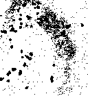

### Combined ranking 综述
该表整合机器学习 Feature importance 与 Pearson 趋势，筛出同时具备判别力与空间一致性的 m/z。

|m/z | 特征重要性 (Feature importance) | 平均 Pearson 相关 (Mean Pearson corr)|
|---|---|---|
|768.59 | 1.0000 | 0.1653|
|357.07 | 0.6933 | -0.0060|
|746.6 | 0.6457 | 0.1526|
|633.17 | 0.5733 | -0.0011|
|897.73 | 0.5336 | 0.0289|

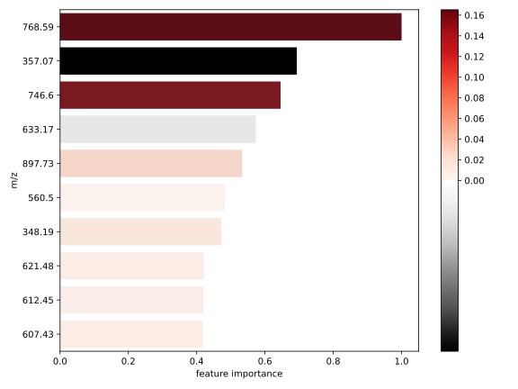

### Spatial similarity 指标
Pearson 与 Cosine 描述 m/z 与 ROI 的空间耦合程度：高值意味着富集，低值/负值提示潜在排斥区域。

**Pearson ranking（Mean corr）**
|m/z | 平均相关 (Mean corr) | 最高样本 (Top sample)|
|---|---|---|
|768.5863 | 0.1653 | UPEC_12 (0.1653)|
|746.6023 | 0.1526 | UPEC_12 (0.1526)|
|744.5874 | 0.1239 | UPEC_12 (0.1239)|
|796.525 | 0.1161 | UPEC_12 (0.1161)|
|720.5885 | 0.1103 | UPEC_12 (0.1103)|

**Cosine ranking（Mean sim）**
|m/z | 平均相似度 (Mean sim) | 最高样本 (Top sample)|
|---|---|---|
|768.5863 | 0.2619 | UPEC_12 (0.2619)|
|746.6023 | 0.2481 | UPEC_12 (0.2481)|
|796.525 | 0.2404 | UPEC_12 (0.2404)|
|780.5508 | 0.2350 | UPEC_12 (0.2350)|
|758.5668 | 0.2244 | UPEC_12 (0.2244)|

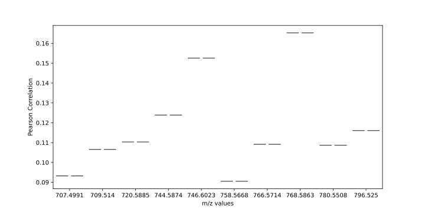

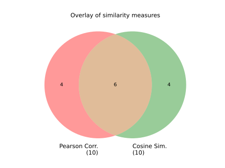
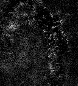

### ML model · XGBoost standard
该分类器区分正负像素，并通过 Feature importance 与 SHAP 概述每个 m/z 的贡献，帮助定位关键离子。

|m/z | 特征重要性 (Feature importance)|
|---|---|
|768.5863037109375 | 1.0000|
|357.0700378417969 | 0.6933|
|746.602294921875 | 0.6457|
|633.1724853515625 | 0.5733|
|897.7254638671875 | 0.5336|

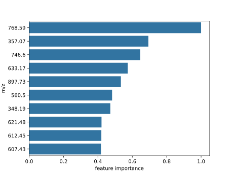

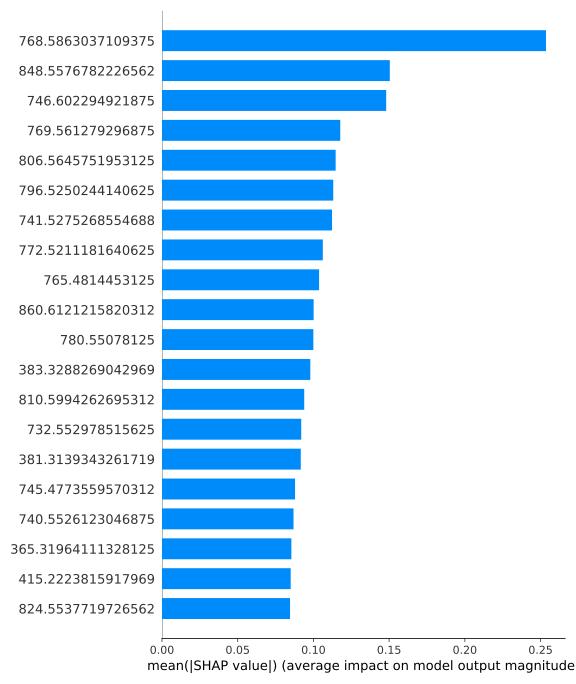

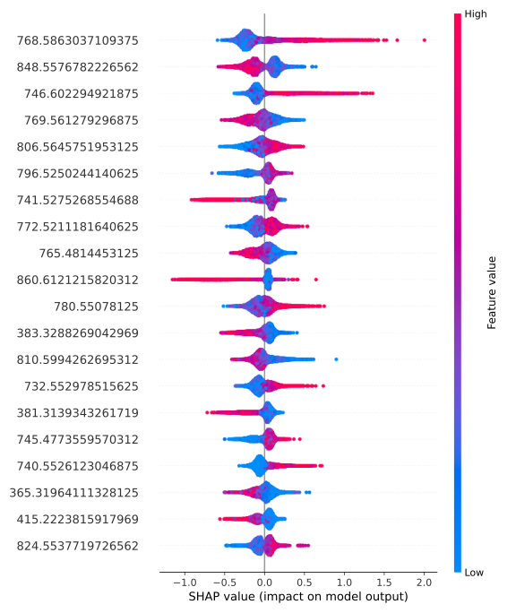

**Representative ion images（代表性离子图）**
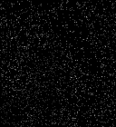
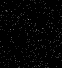
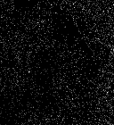
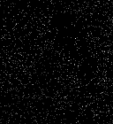
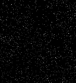
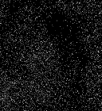
