# Molecular signatures 报告 · ly6g_molecular_signatures

*生成时间：20251204-152951*

本报告聚焦 molecular_signatures_flow，通过 ROI、基于机器学习的特征筛选以及空间相似度分析，串联出与组织表型高度相关的 m/z 特征。

**Workflow 参数**
- Model: `XGBoost`
- Class balancing: `weights`
- Top features: 10
- Ion image export: True
- Ion UMAP export: False

整体流程先将 ROI 映射至测量到的 MSI 像素，再生成正负掩膜训练分类模型，随后结合 SHAP 与 Pearson/Cosine 排名，以多视角验证潜在分子特征的可靠性。

## Class 1 概览

在该 class 中找到 **4** 个样本的正类 ROI：UPEC_12, UPEC_13, UPEC_14, UPEC_15。负类掩膜通过测得像素扣除 ROI 获得，以提供局部背景并提升模型对富集/排斥信号的敏感度。

### ROI alignment 质量
正类掩膜展示 segmentation 标注区域，负类掩膜近似周边背景组织，方便直观评估 ROI 是否与测量像素吻合。

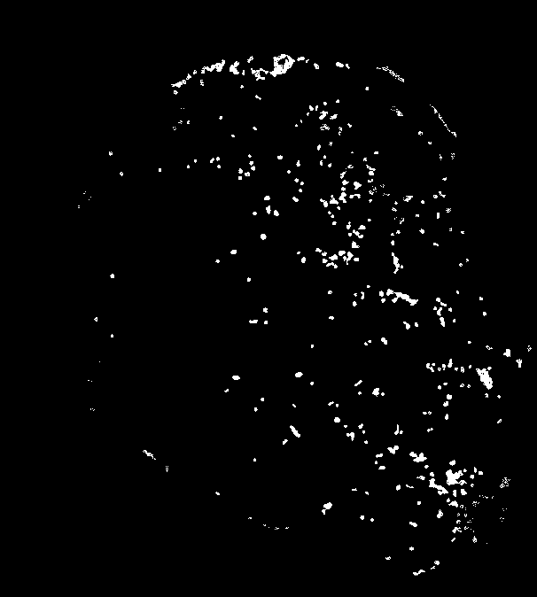
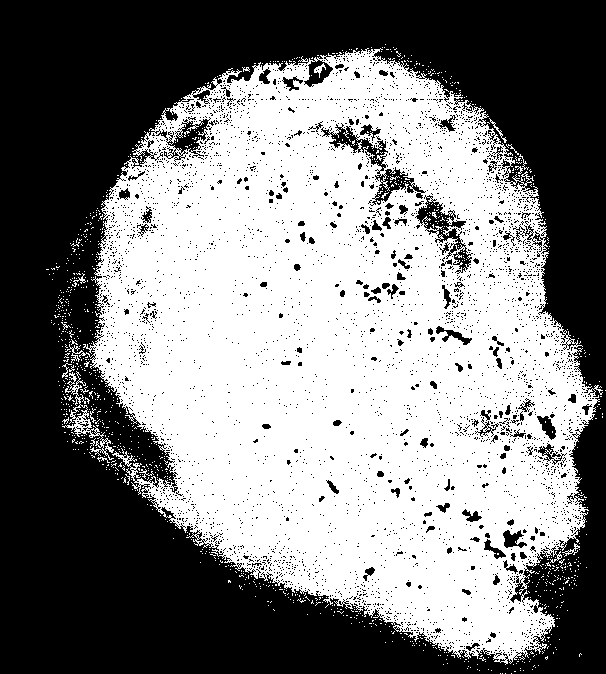

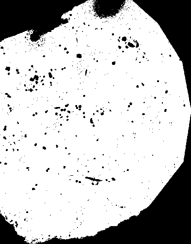
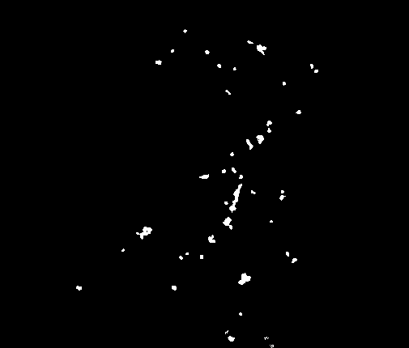
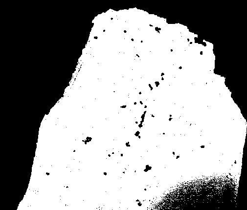
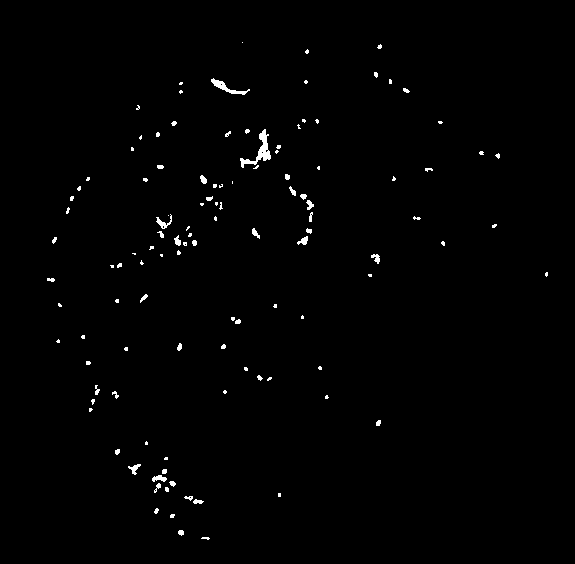
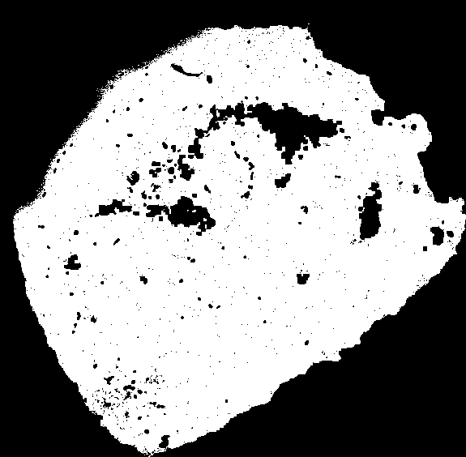

### Combined ranking 综述
该表整合机器学习 Feature importance 与 Pearson 趋势，筛出同时具备判别力与空间一致性的 m/z。

|m/z | 特征重要性 (Feature importance) | 平均 Pearson 相关 (Mean Pearson corr)|
|---|---|---|
|768.59 | 1.0000 | 0.1129|
|796.53 | 0.4587 | 0.1011|
|521.4 | 0.4193 | 0.0402|
|746.6 | 0.3463 | 0.0998|
|701.41 | 0.3343 | 0.0378|

### Spatial similarity 指标
Pearson 与 Cosine 描述 m/z 与 ROI 的空间耦合程度：高值意味着富集，低值/负值提示潜在排斥区域。

**Pearson ranking（Mean corr）**
|m/z | 平均相关 (Mean corr) | 最高样本 (Top sample)|
|---|---|---|
|768.5863 | 0.1129 | UPEC_12 (0.1829)|
|796.525 | 0.1011 | UPEC_12 (0.1446)|
|746.6023 | 0.0998 | UPEC_12 (0.1683)|
|780.5508 | 0.0984 | UPEC_12 (0.1324)|
|744.5874 | 0.0983 | UPEC_12 (0.1530)|

**Cosine ranking（Mean sim）**
|m/z | 平均相似度 (Mean sim) | 最高样本 (Top sample)|
|---|---|---|
|768.5863 | 0.1469 | UPEC_12 (0.2217)|
|796.525 | 0.1439 | UPEC_12 (0.1954)|
|780.5508 | 0.1411 | UPEC_12 (0.1854)|
|824.5538 | 0.1385 | UPEC_12 (0.1689)|
|798.54 | 0.1366 | UPEC_12 (0.1714)|

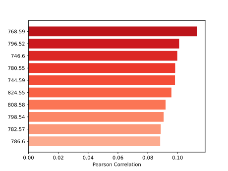
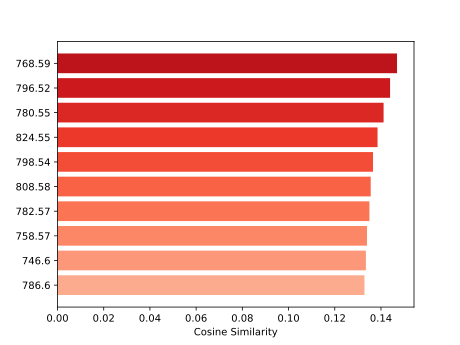
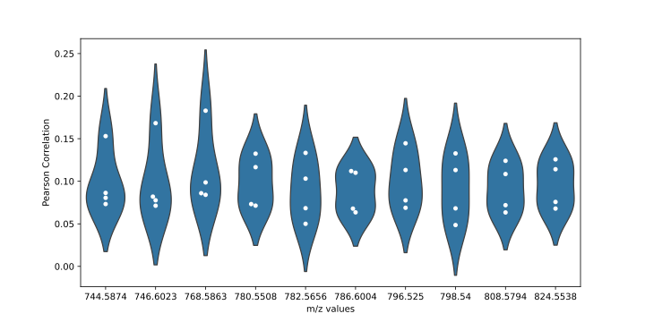

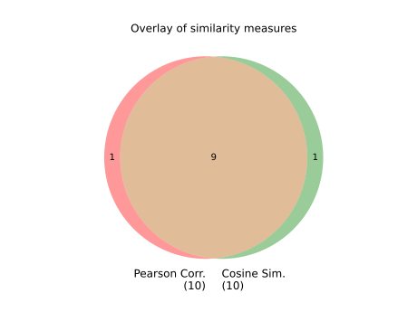
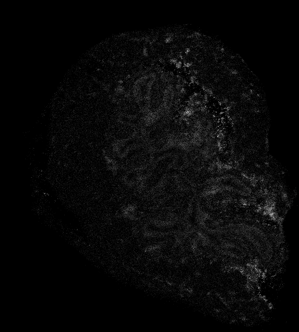
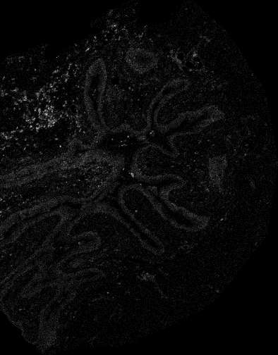
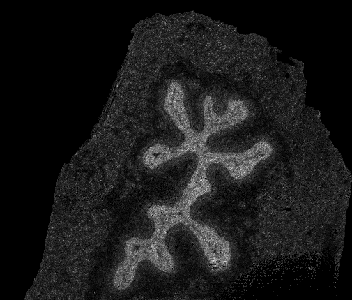
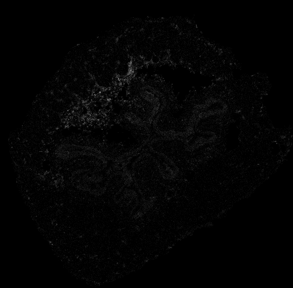

### ML model · XGBoost weights
该分类器区分正负像素，并通过 Feature importance 与 SHAP 概述每个 m/z 的贡献，帮助定位关键离子。

|m/z | 特征重要性 (Feature importance)|
|---|---|
|768.5863037109375 | 1.0000|
|796.5250244140625 | 0.4587|
|521.3975219726562 | 0.4193|
|746.602294921875 | 0.3463|
|701.4093627929688 | 0.3343|

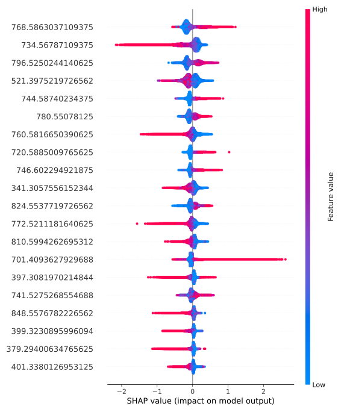

**Representative ion images（代表性离子图）**

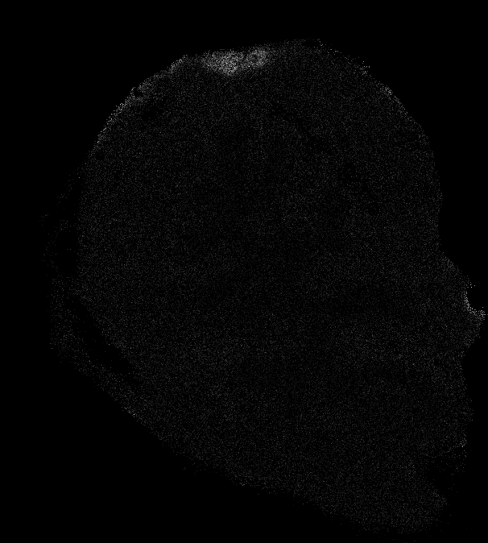
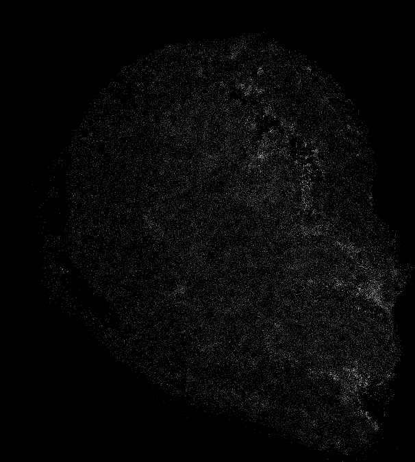
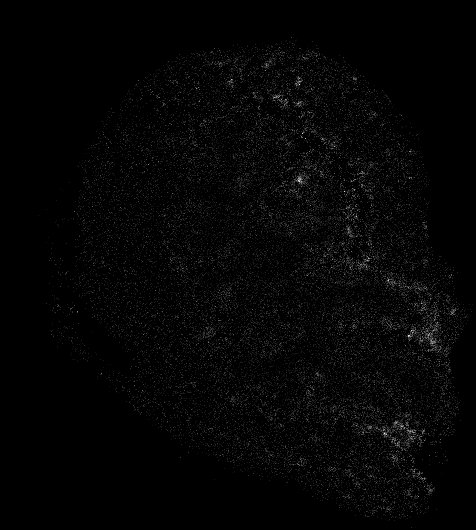
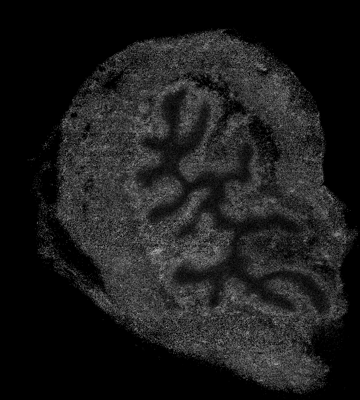
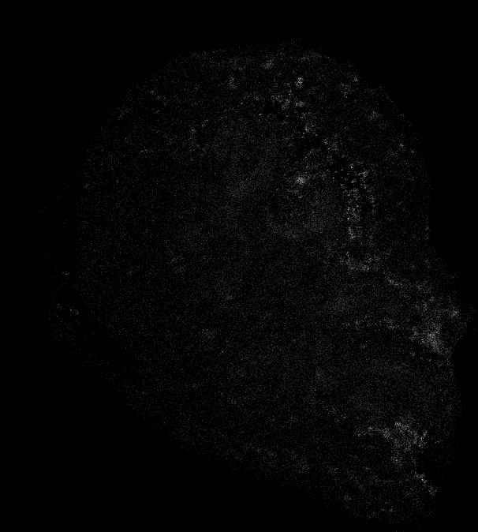
